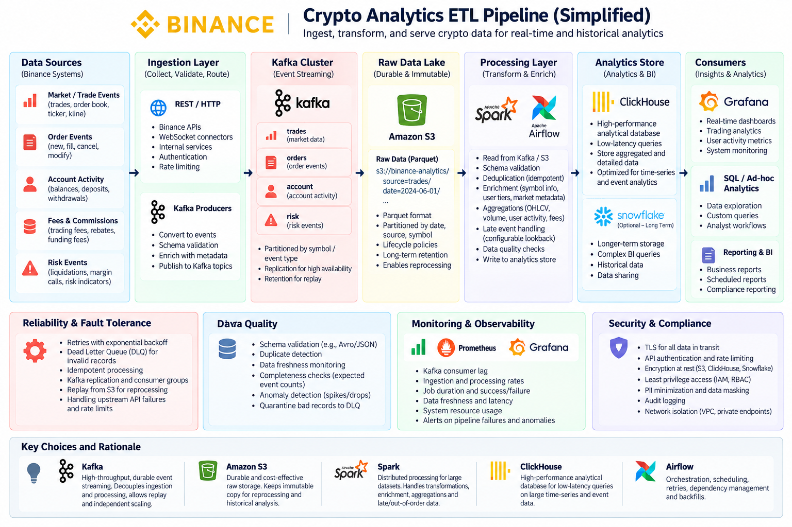

# Binance Crypto Analytics Pipeline

A simplified ETL pipeline design for ingesting, transforming, and serving crypto market and analytics data.

The design focuses on high-volume event ingestion, reliable processing, historical replay, and fast analytics.

## Architecture



## Pipeline

```text
Binance Data Sources
        |
        v
 REST / WebSocket
        |
        v
      Kafka
        |
        v
       S3
        |
        v
 Spark + Airflow
        |
        v
   ClickHouse
        |
        v
 Grafana / SQL / BI
